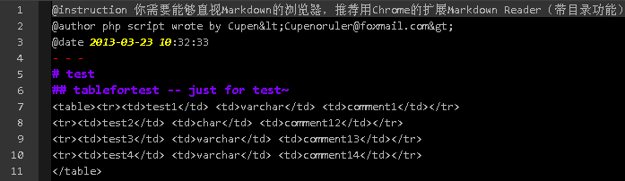

# Example  
    require 'phpmysqldoc.php';
	
    $host = '';
    $port = '';
    $user = '';
    $password = '';
    $database = 'test';
    // or $database = array('test','test2');

    $mysqli = pmd_getMysqli($host, $port, $user,  $password);
    $text = pmd_generateDoc($mysqli, $database);
    writeToFile($text,'test.md');

file://test.md   

It look like this:  
- - -
@instruction 你需要能够直视Markdown的浏览器，推荐用Chrome的扩展Markdown Reader（带目录功能）  
@author php script wrote by Cupen&lt;Cupenoruler@foxmail.com&gt;  
@date 2013-03-23 10:32:33  
- - -  
# test  
## tablefortest -- just for test~  
<table><tr><td>test1</td> <td>varchar</td> <td>comment1</td></tr>  
<tr><td>test2</td> <td>char</td> <td>comment12</td></tr>  
<tr><td>test3</td> <td>varchar</td> <td>comment13</td></tr>  
<tr><td>test4</td> <td>varchar</td> <td>comment14</td></tr>  
</table>   